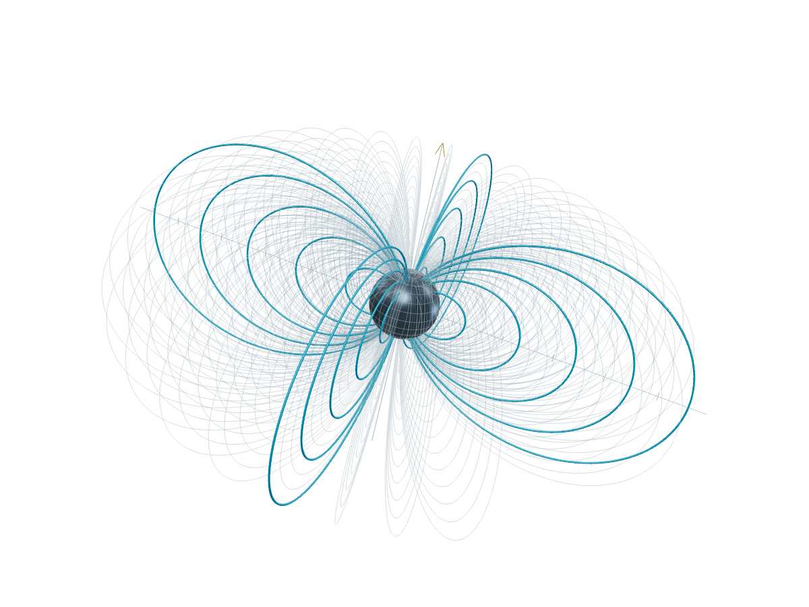

# One question, three views

Start with a changing quantity. Then ask what geometry and a field view make easier to notice.

<SpeakerNotes>
  Explain that each fixture is synthetic or geometric test material.
</SpeakerNotes>

---

## The trace gives the question a tempo

<Chart
  id="signal-chart"
  src="/test/oscillation.csv"
  type="line"
  x="time"
  y="position"
  xLabel="Time (s)"
  yLabel="Position (m)"
  title="A synthetic damped oscillator"
  description="An analytic trajectory with unit initial displacement, provided as a deterministic fixture."
  sample
  parameters
/>

<Note for="signal-chart">
  The CSV is a deterministic test fixture, not measured data.
</Note>

---

## Geometry makes continuity visible

<Model
  id="torus-model"
  src="/test/torus-knot.glb"
  poster="/test/torus-knot.svg"
  title="Torus knot"
  description="A geometric GLB fixture. Drag to orbit and inspect the closed curve."
/>

<Note for="torus-model">
  The model is a geometry specimen, not a physical prototype.
</Note>

---

## The field shows interference at a glance

<Shader
  id="interference-field"
  title="Two-source interference"
  frequency={9}
  angle={24}
/>

<Step>
  Change frequency and angle, then compare the contour spacing before returning
  to the trace.
</Step>

<SpeakerNotes>
  Pause for a reader to use the shader controls before advancing.
</SpeakerNotes>
