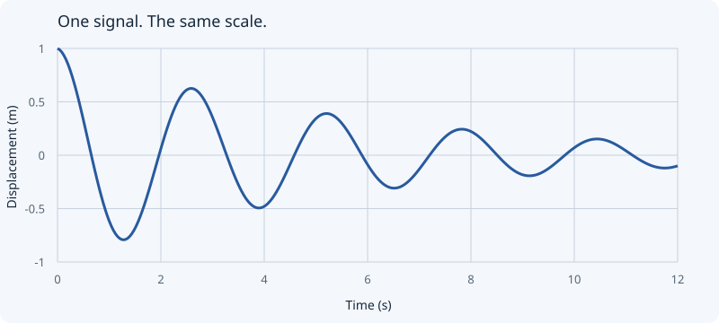
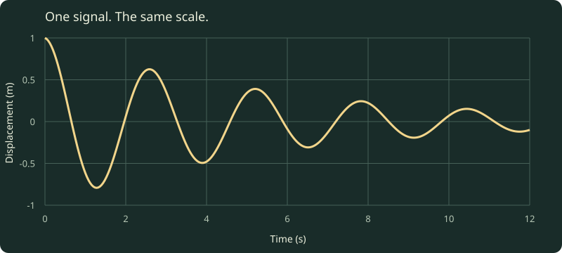

# A page can change its posture

Good presentation layouts follow the material: a question needs room; a table needs a grid; a quote needs silence.

---

<!-- layout: split -->

## A picture can carry the first sentence





Light and dark surfaces show the same analytic signal. The scale and units stay fixed, so the comparison is about legibility.

---

## A list can establish a sequence

- Find the source.
- Name what is synthetic.
- Show the transformation.
- Leave the next question open.

---

> A plot shows how a quantity changes. It does not explain why.

---

## A compact table can keep comparisons honest

| View  | Best for             | Ask before using it     |
| ----- | -------------------- | ----------------------- |
| Trace | Change over time     | What is the unit?       |
| Model | Shape and constraint | What frame is this in?  |
| Field | Pattern and relation | What does color encode? |

---

## A code sample can leave the mechanism open

```ts title="signal.ts" {3-4}
const damping = 0.18;
const frequency = 2.4;
const sample = (time: number) =>
  Math.exp(-damping * time) * Math.cos(frequency * time);
```

The layout stays readable when JavaScript is unavailable; presentation only changes how the same sections are navigated.
