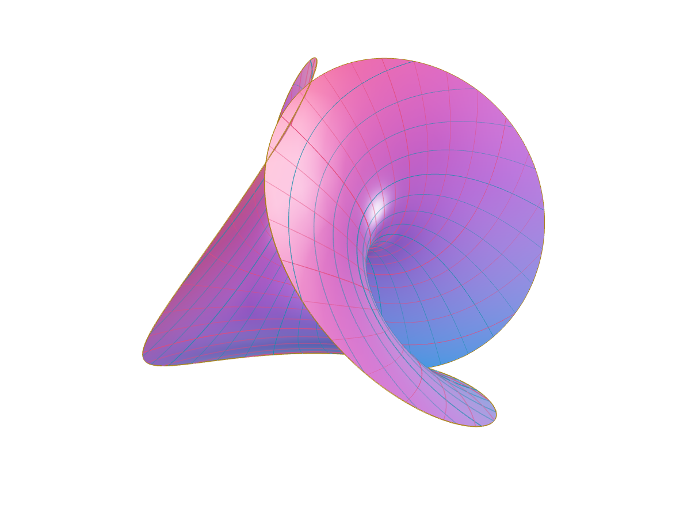

# Listening is a form of inspection

These local files test the browser path without pretending to be a recording session or a finished film.

<SpeakerNotes>
  Make clear that playback begins only after a reader chooses it.
</SpeakerNotes>

---

## A short tone establishes the path

<Audio
  id="tone"
  src="/test/tone.wav"
  title="Test tone"
  caption="A local synthetic tone fixture for the audio component."
/>

<Note for="tone">
  No recording claim is attached to this generated fixture.
</Note>

---

## Motion needs a named source

<Video
  id="wave-study"
  src="/test/waves.mp4"
  poster="/test/media-poster.jpg"
  title="Wave study"
  caption="A local test video used to exercise controls and slide deactivation."
/>

<SpeakerNotes>
  Do not autoplay the video while presenting this slide.
</SpeakerNotes>

---

## A score leaves the timing visible

<Midi
  id="pulse-study"
  src="/test/music/pulse.mid"
  editable
  title="Pulse study"
  caption="A bundled test MIDI file; playback uses the reader's browser synthesizer."
/>

<Step>Open the score, focus the player, then choose playback.</Step>
