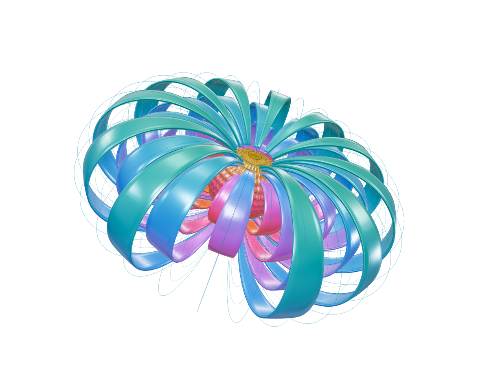
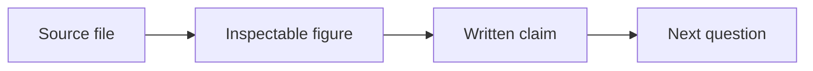

# A signal is a claim in motion

The useful unit is not a chart. It is a trace, a model, and a question that can still be checked.



<!-- notes: Start with the notebook rather than the finished chart. -->

---

## Begin with the surface


This is a site study, not an observation. The data used later is synthetic.[^fixture]

[^fixture]: The chart fixture follows an analytic damped oscillator.

---

## Name the quantities before the curve

| Quantity | Meaning      | Unit |
| -------- | ------------ | ---- |
| $t$      | elapsed time | s    |
| $x(t)$   | displacement | m    |

$$
x(t) = e^{-0.18t}\cos(2.4t)
$$

---

## Let the short model stay inspectable

```typescript title="oscillator.ts" {4-5} focus={4-5}
const damping = 0.18;
const frequency = 2.4;
const displacement = (time: number) =>
  Math.exp(-damping * time) * Math.cos(frequency * time);
```

> [!NOTE]
> This is an analytic teaching fixture, not an observation from an instrument.

---

## A result should leave a trail



The point is not a beautiful diagram. It is a path back to what the diagram means.

<!-- notes: The alert and diagram are Markdown fences; explain their source role. -->
