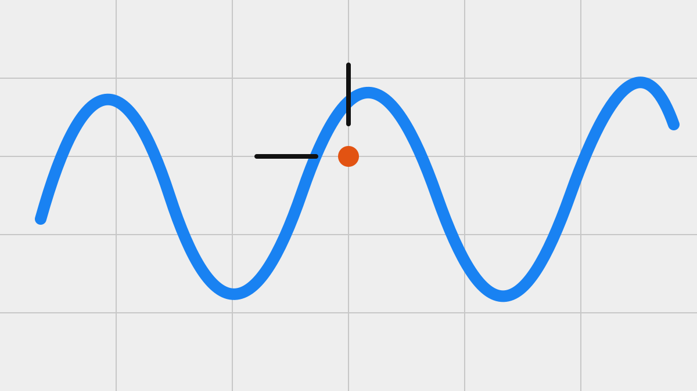

# Start with a question worth showing

Markdown is enough for the part of a talk that needs to remain easy to inspect.

<!-- notes: Introduce the question before describing the work. -->

---

## Give the observation a shape

- Name the observation.
- Link the evidence.
- Leave one useful next question.

---

## Let the source stay close

> A deck can be concise without hiding how its claims were made.

Use `.mdx` only when an interactive figure helps the reader test the idea.
